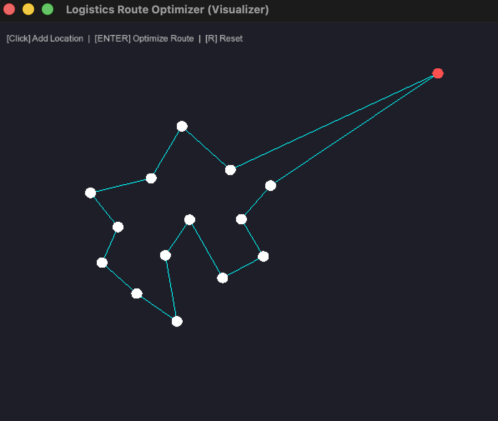

# 📍 Optimal Route Finder
### Traveling Salesperson Problem (TSP) Visualizer


> **A high-performance interactive tool that visualizes combinatorial optimization using Dynamic Programming.**

---

## 📸 Demo


---

## 📖 Overview
**Optimal Route Finder** is a C++ application designed to solve the **Traveling Salesperson Problem (TSP)** efficiently for small to medium datasets. Unlike basic greedy approaches, this engine utilizes the **Held-Karp algorithm** (Dynamic Programming with Bitmasking) to guarantee the mathematically shortest possible route between multiple locations.

The project features a real-time graphical interface built with **SFML**, allowing users to interactively place nodes (cities) and instantly visualize the optimal path construction.

## ✨ Key Features
* **Interactive Visualization**: Click to add delivery points on a 2D grid.
* **Guaranteed Optimality**: Uses exact algorithms (DP) instead of approximations.
* **Real-Time Rendering**: Smooth 60 FPS rendering using hardware acceleration.
* **Clean Architecture**: Modular C++ codebase with separation of concerns (Logic vs. UI).

## 🛠️ Tech Stack
* **Language**: C++17
* **Graphics Engine**: SFML (Simple and Fast Multimedia Library) 3.0.0
* **Algorithm**: Held-Karp Algorithm (Bitmask DP)
* **Time Complexity**: $O(n^2 2^n)$

---

## 🚀 Getting Started

### Prerequisites
You need a C++ compiler and the SFML library installed on your system.

**For macOS (Homebrew):**
```bash
brew install sfml
```
### 📥 Installation & Running

1. **Clone the Repository**
   Open your terminal and run:
   ```bash
   git clone [https://github.com/saiduzzaman-sojib/Optimal-Route-Finder.git](https://github.com/saiduzzaman-sojib/Optimal-Route-Finder.git)
   cd Optimal-Route-Finder
   ```
   2. **Compile and Run**
   Run the following command in your terminal:
   ```bash
   g++ main.cpp -o app -std=c++17 -I/opt/homebrew/include -L/opt/homebrew/lib -lsfml-graphics -lsfml-window -lsfml-system && ./app
   ```
 ## 🎮 Controls

| Key / Action | Description |
| :--- | :--- |
| **Left Click** | Add a new location (City/Node). |
| **ENTER** | Calculate and draw the optimal route (Cyan Line). |
| **R** | Reset the canvas to start over. |

## 🧠 Algorithm Details
The core engine solves the TSP metric problem. Instead of a brute-force approach ($O(n!)$), we use **Dynamic Programming** with the following recurrence relation:

$$
C(S, i) = \min_{j \in S, j \neq i} \{ C(S \setminus \{i\}, j) + d_{ji} \}
$$

**Where:**
* $S$ is the set of visited cities.
* $d_{ji}$ is the distance between city $j$ and city $i$.
 ## 👨‍💻 Author
**Md Saiduzzaman**
* **Role**: CSE Student @ Southeast University.
* **GitHub**: [@saiduzzaman-sojib](https://github.com/saiduzzaman-sojib)
